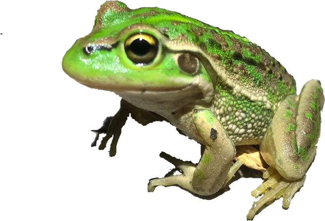

# Stochastic Population Model for <i>Litoria raniformis</i>

These files underpin the aspatial stochastic population models presented in the article "Modelling the effects of water regulation on the population viability of threatened amphibians"

<strong>AUTHOR</strong>: Rupert Mathwin, Matt S. Gibbs and Corey J. A. Bradshaw 
<strong>CONTACT</strong>: rupert.mathwin.ecology@gmail.com 
<strong>URL</strong>: http://GlobalEcologyFlinders.com 
<strong>INSTITUTION</strong>: Flinders University; Rupert Mathwin Ecology 
<strong>RELEASE DATE</strong>: September 2022 

R code accompanies article: 

<strong>Mathwin, R, Wassens, S, Gibbs, MS, Young, J, Ye, Q, Saltré, F,</strong> and <strong>Bradshaw, CJA</strong>. 2022. <a href="http://doi.org/10.1002/ecs2.4379">Modelling the effects of water regulation on the population viability of threatened apmphibians</a>. <i>Ecosphere</i> e4379. doi:10.1002/ecs2.4379

<strong>AIM</strong>: Stochastic population model of the population viability of <i>Litoria raniformis</i> at wetlands of four size classes at sill heights of 7 to 11 metres mAHD under natural and regulated flow between Locks 3 and 2 in southern Australia's Murray-Darling Basin. 

Repository includes the following files:
- '<a href="https://github.com/cjabradshaw/MegafaunaSusceptibility/blob/master/matrixOperators.r">matrixOperators.R</a>' — functions to manipulate matrix models
- '<a href="https://github.com/RupertLovesEcology/RiverRegulation_Frog_PopModel/blob/main/Aspatial_Lraniformis_V10.R">Aspatial_Lraniformis_V10.R</a>' — R code to run all population models
- '<a href="https://github.com/RupertLovesEcology/RiverRegulation_Frog_PopModel/blob/main/Aspatial_Lraniformis_V10_global sensitivity_LHCandBRT.R">Aspatial_Lraniformis_V10_global sensitivity_LHCandBRT.R</a>' — R code to run global sensitivity analysis on the apsatial Lraniformis models
- '<a href="https://github.com/RupertLovesEcology/RiverRegulation_Frog_PopModel/blob/main/CompHeightL3.csv">CompHeightL3.csv</a>' — wetland inundation records used to construct Markov-chains for stochastic resampling of inundation regimes
- '<a href="https://github.com/RupertLovesEcology/RiverRegulation_Frog_PopModel/blob/main/ratingCurve.csv">ratingCurve.csv</a>' — The known depth:flow ratio immediately downstream of the river height logger which informs the conversion of modelled natural flow to river height

